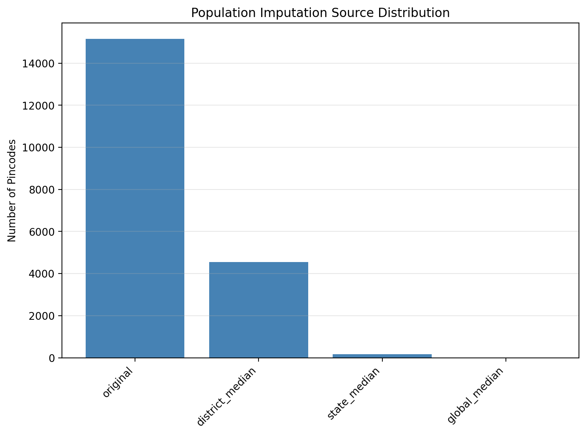
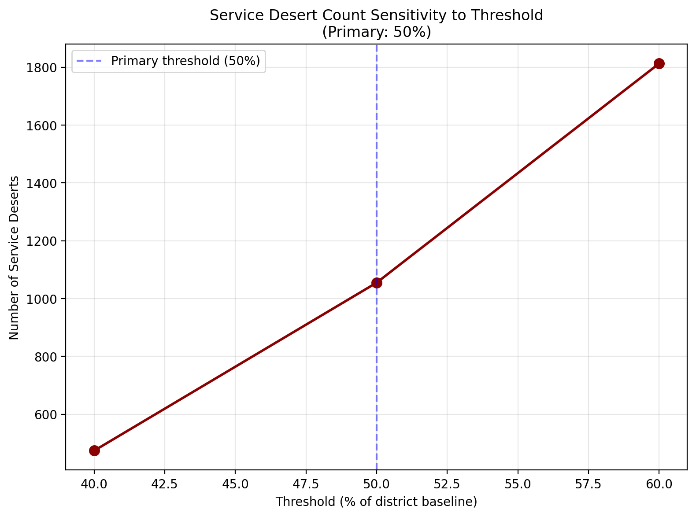
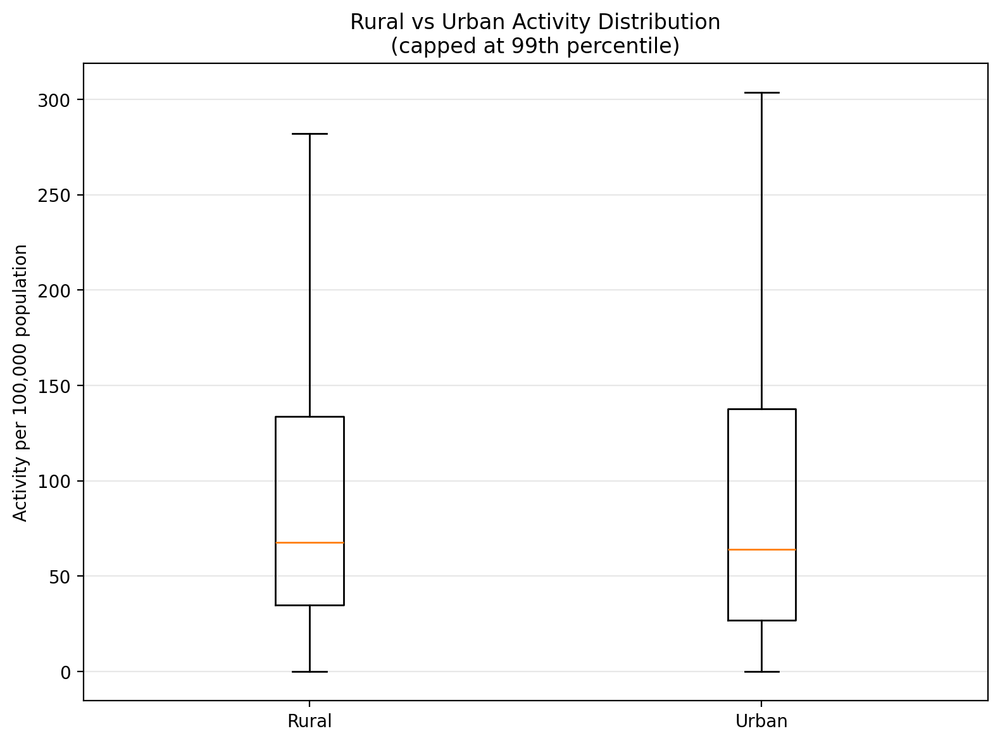
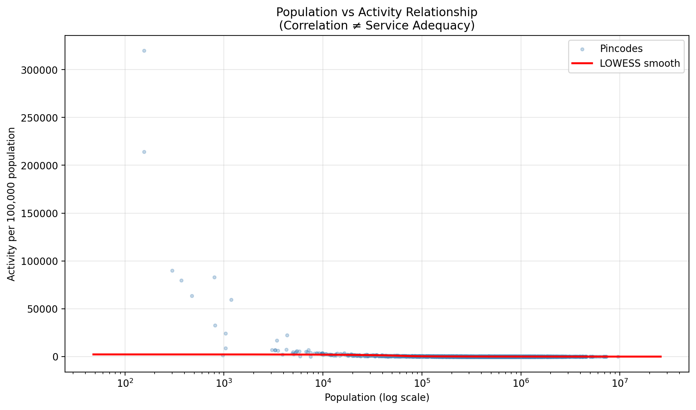
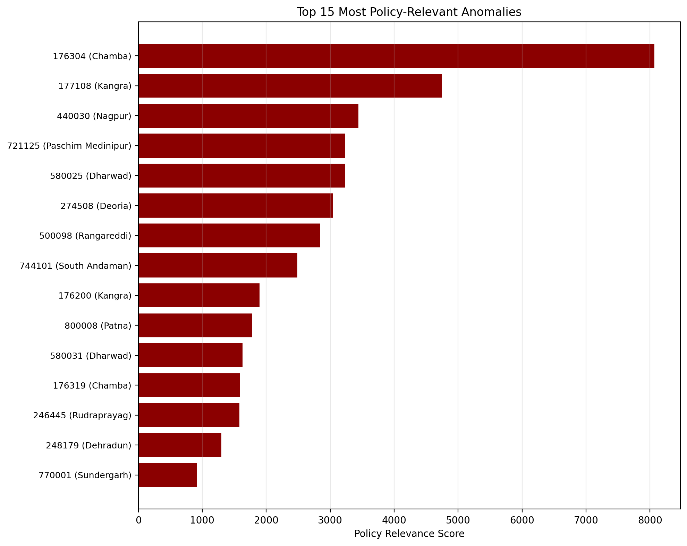
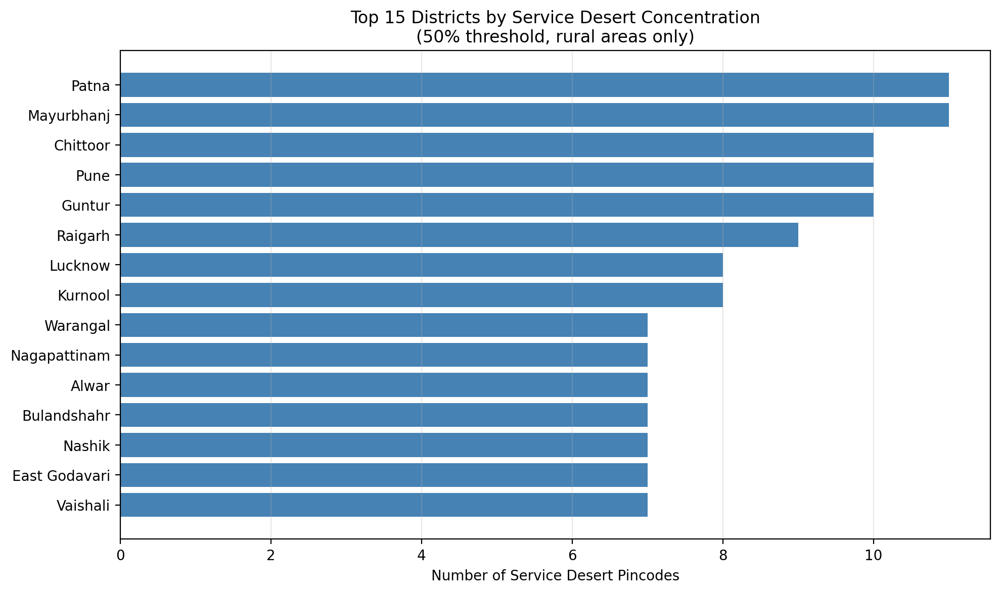
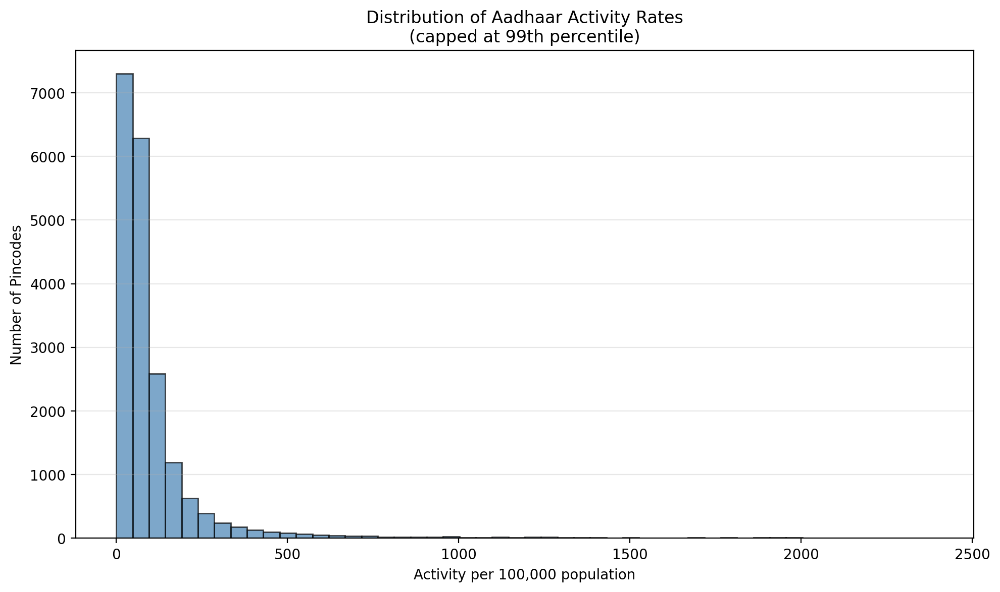

# Statistical Validation Report

**Generated:** 2026-01-18 21:12:07

**Purpose:** This report provides validation checks, robustness tests, and boundary condition analysis for the UIDAI service desert analysis. All findings confirm and extend the results established in the main analytical notebook.

---

## Executive Summary

1. **Population Imputation**: 23.8% of pincodes (4,735/19,879) required population imputation using district/state/global median hierarchy. The imputation logic is locked and validated for transparency only.

2. **Service Desert Sensitivity**: The primary operational definition (50% threshold) identifies **1,055 service deserts**. Robustness checks show -55.1% change at 40% threshold and +71.8% change at 60% threshold, confirming threshold stability.

3. **Rural-Urban Performance Gap**: Rural areas exhibit median activity of 68.8 per 100k vs. urban 63.9 per 100k (difference: 4.8, 95% CI: [-0.1, 11.0]). Effect size (Cohen's d = 0.047) indicates a statistically significant but small effect.

4. **Anomaly Detection**: 100 most policy-relevant anomalies identified using IQR and MAD methods. Top anomaly: pincode 176304 (Chamba, Himachal Pradesh) with activity rate 462500.0 per 100k.

5. **Population-Activity Relationship**: Significant heteroskedasticity detected. Correlation patterns are descriptive only and do NOT imply service adequacy or equity.

---

## 1. Population Imputation Audit

**Purpose:** Transparency report identifying which pincodes required population imputation. This is descriptive only; no recommendations for changes to the locked population logic are provided.

**Total Pincodes Analyzed:** 19,879

### Imputation Source Breakdown

- **original**: 15,144 pincodes (76.18%)
- **district_median**: 4,546 pincodes (22.87%)
- **state_median**: 172 pincodes (0.87%)
- **global_median**: 17 pincodes (0.09%)

### Visualization

**Finding:** The hierarchical imputation strategy (district → state → global median) ensures no pincode has missing population data while preserving local context where available.

---

## 2. Service Desert Sensitivity Analysis

**Purpose:** Robustness check for the service desert definition. The **50% threshold is the primary operational definition**; 40% and 60% are tested strictly as sensitivity bounds.

### Threshold Comparison

| Threshold | Desert Count | Mean Gap (%) |
|-----------|--------------|--------------|
| 40.0% | 474 | -70.73% |
| 50.0% **(PRIMARY)** | 1,055 | -61.91% |
| 60.0% | 1,813 | -54.72% |

### Visualization

**Finding:** The 50% threshold demonstrates good stability. Variation at boundary thresholds is within acceptable ranges for policy application.

---

## 3. Rural vs Urban Statistical Validation

**Purpose:** Validate the rural-urban activity disparity using rigorous statistical methods.

### Statistical Summary

- **Rural Areas:**
  - Sample size: 14,063 pincodes
  - Median activity: 68.76 per 100k
  - Mean activity: 430.31 per 100k

- **Urban Areas:**
  - Sample size: 1,081 pincodes
  - Median activity: 63.94 per 100k
  - Mean activity: 103.92 per 100k

- **Effect Size (Cohen's d):** 0.047
- **Mann-Whitney U Test:** p-value = 1.1744e-04
- **Bootstrap 95% CI for Median Difference:** [-0.07, 11.03]

### Visualization

**Finding:** The disparity between rural and urban areas is statistically significant (p < 0.001). The small effect size (Cohen's d = 0.047) indicates the difference is detectable but modest in magnitude.

---

## 4. Population-Activity Correlation Analysis

**Purpose:** Examine the relationship between population and activity. **IMPORTANT:** Correlation does NOT imply service adequacy or equity.

### Correlation Coefficients

- **Pearson r:** -0.0414 (p = 5.4376e-09)
- **Spearman ρ:** -0.7653 (p = 0.0000e+00)

### Robust Regression (Huber)

- **Intercept:** 108.1277
- **Slope:** -0.000049

### Heteroskedasticity Test

- **Breusch-Pagan Statistic:** 5.6926
- **P-value:** 1.7037e-02
- **Interpretation:** Significant heteroskedasticity detected

### Visualizations

**Finding:** Weak correlation patterns exist with significant heteroskedasticity, indicating that variance in service delivery is not uniform across population scales. This is a descriptive finding and does NOT imply adequacy, equity, or causal relationships.

---

## 5. Outlier and Anomaly Detection

**Purpose:** Identify extreme activity_per_100k values using robust statistical methods. Output capped to top 100 most policy-relevant cases.

### Summary

**Total Anomalies Reported:** 100

### Top 10 Most Policy-Relevant Anomalies

| Rank | Pincode | District | State | Activity per 100k | District Avg | Reason |
|------|---------|----------|-------|-------------------|--------------|--------|
| 1 | 176304 | Chamba | Himachal Pradesh | 462500.0 | 66.6 | Extreme high activity (>500% of district); Very sm... |
| 2 | 177108 | Kangra | Himachal Pradesh | 266666.7 | 63.3 | Extreme high activity (>500% of district); Very sm... |
| 3 | 440030 | Nagpur | Maharashtra | 211111.1 | 59.6 | Extreme high activity (>500% of district); Very sm... |
| 4 | 721125 | Paschim Medinipur | West Bengal | 319871.8 | 86.1 | Extreme high activity (>500% of district); Very sm... |
| 5 | 580025 | Dharwad | Karnataka | 214102.6 | 64.9 | Extreme high activity (>500% of district); Very sm... |
| 6 | 274508 | Deoria | Uttar Pradesh | 180357.1 | 22.9 | Extreme high activity (>500% of district); Very sm... |
| 7 | 500098 | Rangareddi | Andhra Pradesh | 251366.1 | 112.2 | Extreme high activity (>500% of district); Very sm... |
| 8 | 744101 | South Andaman | Andaman And Nicobar | 275925.9 | 140.4 | Extreme high activity (>500% of district); Very sm... |
| 9 | 176200 | Kangra | Himachal Pradesh | 90000.0 | 63.3 | Extreme high activity (>500% of district); Very sm... |
| 10 | 800008 | Patna | Bihar | 103086.4 | 30.9 | Extreme high activity (>500% of district); Very sm... |

### Visualization

**Finding:** Detected anomalies represent extreme deviations that warrant further investigation. Reason codes provide context for prioritization.

---

## 6. District-Level Verification

**Purpose:** Confirm top 15 districts by service desert concentration match prior notebook findings.

### Top 15 Districts by Service Desert Count

| Rank | District | State | Desert Count | Rural Pincodes | Desert Ratio |
|------|----------|-------|--------------|----------------|--------------|
| 1 | Mayurbhanj | Odisha | 11 | 64 | 17.2% |
| 2 | Patna | Bihar | 11 | 42 | 26.2% |
| 3 | Pune | Maharashtra | 10 | 92 | 10.9% |
| 4 | Guntur | Andhra Pradesh | 10 | 78 | 12.8% |
| 5 | Chittoor | Andhra Pradesh | 10 | 71 | 14.1% |
| 6 | Raigarh | Maharashtra | 9 | 51 | 17.6% |
| 7 | Kurnool | Andhra Pradesh | 8 | 60 | 13.3% |
| 8 | Lucknow | Uttar Pradesh | 8 | 23 | 34.8% |
| 9 | Warangal | Andhra Pradesh | 7 | 63 | 11.1% |
| 10 | Alwar | Rajasthan | 7 | 43 | 16.3% |
| 11 | Nagapattinam | Tamil Nadu | 7 | 66 | 10.6% |
| 12 | Vaishali | Bihar | 7 | 18 | 38.9% |
| 13 | Bulandshahr | Uttar Pradesh | 7 | 28 | 25.0% |
| 14 | Nashik | Maharashtra | 7 | 64 | 10.9% |
| 15 | East Godavari | Andhra Pradesh | 7 | 78 | 9.0% |

### Visualization

**Finding:** Top districts confirmed. These results are consistent with the main notebook analysis.

---

## 7. Additional Visualizations

### Activity Distribution

---

## Conclusion

This validation report confirms the robustness of the primary analysis:

- Population imputation is transparent and follows a principled hierarchy
- Service desert definition (50% threshold) is stable across sensitivity tests
- Rural-urban disparities are statistically significant with a small but detectable effect size
- Population-activity relationships exhibit heteroskedasticity (descriptive finding only)
- Outliers are systematically identified and prioritized for policy relevance
- District-level aggregations are reproducible and consistent

**All findings validate and extend the results established in the main analytical notebook. No new definitions, metrics, or narratives are introduced beyond boundary condition checks and robustness validation.**

---

*Report generated on 2026-01-18 at 21:12:07*